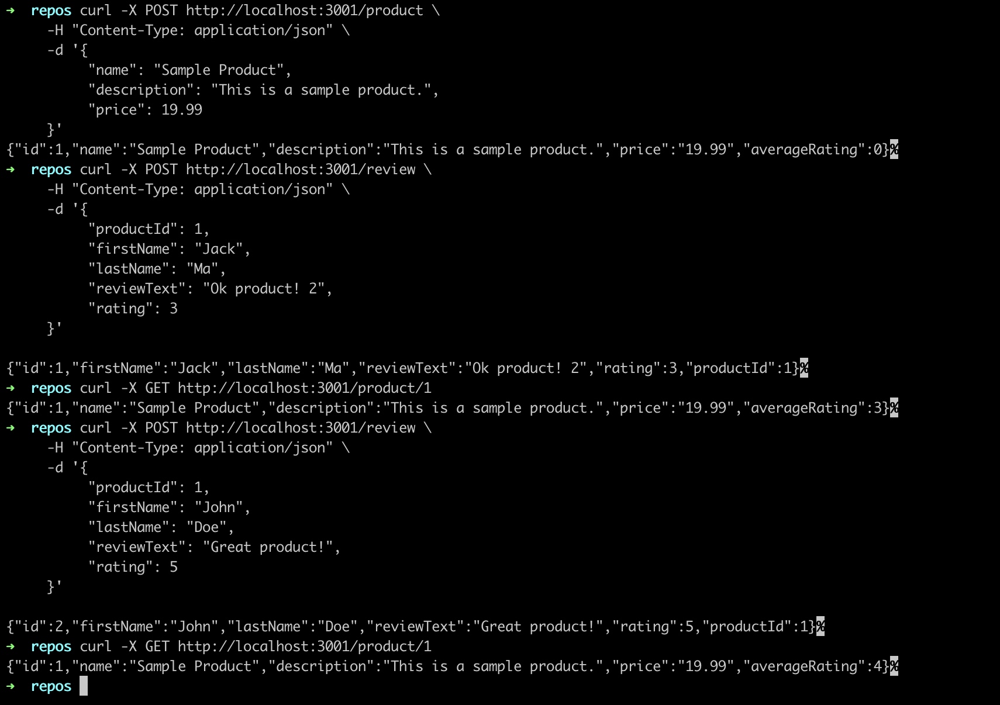

# Product Review and Inventory Management System

## Description

This project is a two-service system responsible for managing product inventories, product reviews, and calculating basic review metrics. The system consists of the following two services:

### 1. **Product Service**

- Exposes a REST API supporting CRUD operations for product management.
- Handles adding, deleting, and updating product reviews.
- Notifies the **Review Processing Service** whenever a review is created, deleted, or updated.

### 2. **Review Processing Service**

- Listens to review creation, update, and deletion events from the **Product Service**.
- Updates review metrics based on the received events.

---

## Tech Stack

### Databases

#### **PostgreSQL**
- **Reasons for choosing SQL database:**
  - To avoid data duplication (data normalization).
  - Future support for advanced search queries based on product requirements.
  - Potential for performing complex analytical operations (OLAP).
  - Efficient retrieval of only the required rows, avoiding the need to load all data into memory (as in document databases).
  - PostgreSQL is open-source, avoiding licensing fees.

#### **Redis**
- **Reasons for using Redis as a caching layer:**
  - High performance as an in-memory data store, reducing latency.
  - Supports time-to-live (TTL) on keys, simplifying caching strategy implementation.

### Messaging System

#### **RabbitMQ**
- **Reasons for choosing RabbitMQ:**
  - Open-source and highly reliable.
  - Supports horizontal scaling, handling large volumes of messages for system scalability.
  - Enables loose coupling with asynchronous communication.
  - Provides message durability through acknowledgments, reducing the risk of message loss.

### Frameworks

#### **Express.js**
- **Reasons for choosing Express.js:**
  - Ease of use and familiarity, accelerating development speed.

#### **Knex.js**
- **Reasons for choosing Knex.js for SQL database interaction:**
  - Flexibility in constructing SQL queries, with the option for raw queries when needed.
  - Preference for query construction over opinionated ORMs.
  - Simple interface for handling database migrations.

---

## Design Considerations

### Three-Layer Architecture

- Loosely coupled code structure with separation of concerns.
- Easy component swapping (e.g., changing backend framework or database) without affecting other layers.
- Business logic remains independent of the tech stack, making the system versatile.
- Extensible and maintainable, as the system can grow without modifying existing code.

### Dependency Injection

- Simplifies testing by allowing component mocking.
- Promotes composition over inheritance.
- Makes system components easily understandable by viewing them in one place.

### Asynchronous Communication

- Promotes loose coupling between microservices.
- Enhances performance by allowing upstream services to proceed without waiting for downstream responses.
- Prevents cascading failures if a downstream service crashes.
- Also promotes event-driven-architecture

---

## Data Models

This project includes three primary data models: **Product**, **Review**, and **Stats**. Each model is designed to facilitate efficient data management and retrieval for product inventory and review metrics.

### 1. Product Model

| Column Name   | Data Type    | Constraints       | Description                                |
|---------------|--------------|-------------------|--------------------------------------------|
| `id`          | Integer      | Primary Key       | Unique identifier for each product.       |
| `name`        | String       | Not Nullable      | The name of the product.                  |
| `description` | Text         |                   | A detailed description of the product.    |
| `price`       | Decimal      | Not Nullable      | The price of the product (max 10 digits, 2 decimal places). |
| `created_at`  | Timestamp    |                   | Timestamp for when the product was created. |
| `updated_at`  | Timestamp    |                   | Timestamp for when the product was last updated. |

- **Purpose**: The `product` table stores essential details about each product available in the inventory, including its name, description, and price.
- **Rationale**:
  - The use of `id` as a primary key ensures that each product can be uniquely identified.
  - The `name` and `price` fields are marked as not nullable to guarantee that all products have a name and price, essential attributes for any inventory system.
  - The `timestamps` feature automatically tracks when products are created and updated, allowing for better auditability and management.

### 2. Review Model

| Column Name    | Data Type    | Constraints       | Description                                      |
|----------------|--------------|-------------------|--------------------------------------------------|
| `id`           | Integer      | Primary Key       | Unique identifier for each review.               |
| `firstName`    | String       | Not Nullable      | The first name of the reviewer.                  |
| `lastName`     | String       | Not Nullable      | The last name of the reviewer.                   |
| `reviewText`   | Text         | Not Nullable      | The content of the review.                       |
| `rating`       | Integer      | Not Nullable, Check (1-5) | The rating given by the reviewer (1-5 scale). |
| `productId`    | Integer      | Foreign Key       | References `id` in the product table.           |
| `created_at`   | Timestamp    |                   | Timestamp for when the review was created.      |
| `updated_at`   | Timestamp    |                   | Timestamp for when the review was last updated. |

- **Purpose**: The `review` table captures customer feedback for each product, including the reviewer's name, review content, and a rating score.
- **Rationale**:
  - By linking reviews to products via the `productId` foreign key, we maintain referential integrity; if a product is deleted, its associated reviews are automatically removed (`onDelete('CASCADE')`).
  - The `check` constraint on the `rating` field ensures that ratings are restricted to a valid range (1-5), promoting data consistency. 

### 3. Stats Model

| Column Name             | Data Type    | Constraints       | Description                                   |
|-------------------------|--------------|-------------------|-----------------------------------------------|
| `productId`             | Integer      | Primary Key, Foreign Key | References `id` in the product table.   |
| `avgRating`             | Float        | Not Nullable, Default (0) | The average rating of the product.       |
| `reviewCount`           | Integer      | Not Nullable, Default (0) | The total number of reviews for the product. |
| `totalRatingPoints`     | Integer      | Not Nullable, Default (0) | The sum of all rating points for the product. |

- **Purpose**: The `stats` table precomputes and stores aggregated metrics related to product reviews, such as average rating, total number of reviews, and total rating points.
- **Rationale**:
  - Precomputing metrics in the `stats` table is efficient for performance, as it avoids the need to recalculate these values every time they are requested. This is particularly beneficial when displaying product ratings and review counts on product pages.
  - Storing these metrics reduces database load, as complex queries that involve aggregating large sets of review data can be expensive in terms of performance.
  - Having a dedicated stats table allows for quicker access to essential data that can enhance user experience by providing real-time insights into product performance.

---

## How to Run the Project

### Prerequisites

- **Tools required**: npm, Docker, Node.js, Git, Knex.js (must be installed globally with `npm i knex -g`).

### Project Dependencies Setup

- The project includes a `docker-compose` file to set up project dependencies:
  - **PostgreSQL** for database management.
  - **Adminer** to inspect PostgreSQL tables (accessible on `localhost:8080`).
  - **RabbitMQ** for messaging.
  - **Redis** as a caching layer.
  - **Redis Commander** to inspect the Redis cache (accessible on `localhost:6379`).

- **Note**: The services are not containerized at this stage, and run outside of Docker. Dockerfiles for the services can be added in future development stages.

### Product Service Setup

1. Enter the directory: `cd product-review/product-service`
2. Install dependencies: `npm i`
3. Spin up containers: `docker-compose up -d`
4. Run database migrations: `knex migrate:latest`
5. Start the service: `npm run dev`
6. Format the code: `npm run format` (Prettier)

### Review Processing Service Setup

1. Enter the directory: `cd product-review/review-processing-service`
2. Install dependencies: `npm i`
3. Start the service: `npm run dev`
4. Format the code: `npm run format` (Prettier)

---

## Testing the Project

- No unit test coverage is provided at this stage.
- Bash scripts are available in `product-review/test-scripts` to manually test each endpoint.

Testing example

